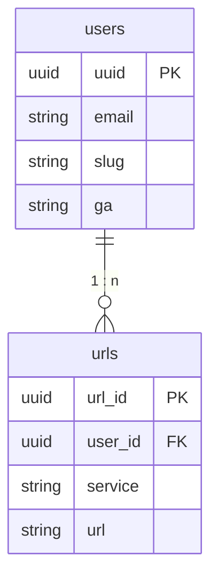

# ER Relation

```mermaid
erDiagram

%% ユーザー情報
users {
	uuid uuid PK
	string email
	string slug
	string ga
}

%% URL
urls {
	uuid url_id PK
	uuid user_id FK
	string service
	string url
}

users ||--o{ urls: "1 : n"
```